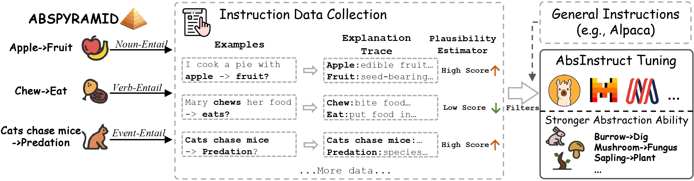

# [ACL 2024] AbsInstruct: Eliciting Abstraction Ability from LLMs through Explanation Tuning with Plausibility Estimation

This repository is the official implementation of ACL 2024 paper 
[AbsInstruct: Eliciting Abstraction Ability from LLMs through Explanation Tuning with Plausibility Estimation](https://arxiv.org/abs/2402.10646).

<h5 align="center">
  
[](https://github.com/HKUST-KnowComp/AbsPyramid/blob/main/LICENSE)
[](https://github.com/tatsu-lab/stanford_alpaca/blob/main/DATA_LICENSE)
[](https://www.python.org/downloads/release/python-380/)

</h5>

<div align="center">
    
    <br>
    <span>An illustration of our AbsInstruct Framework.</span>
</div>


## Requirements
Python version is 3.8.5

requirements:
```setup
bert_score==0.3.13
datasets==2.13.1
evaluate==0.4.1
nltk==3.8.1
numpy==1.24.4
pandas==2.0.3
peft==0.6.2
rouge_score==0.1.2
scikit_learn==1.3.0
spacy==2.3.2
torch==2.0.1
transformers==4.34.0
```
You can install all requirements with the command
```
pip install -r requirements.txt
```

## Instructions from AbsInstruct
Our framework collects instructions of abstraction detection and combined them with [Alpaca](https://github.com/tatsu-lab/stanford_alpaca).
The mixed instructions are put in the ```data``` folder.

**Usage and License Notices:** Since the Alpaca dataset is released under the CC BY NC 4.0 (allowing only non-commercial use), our
datasets are also released under the CC BY NC 4.0 License. Models trained using our dataset should not be used outside of research purposes.
Meanwhile, the code license is Apache 2.0, which is a more permissive license. 

If you use our code to build mixed datasets with other instruction datasets,
the licenses are subject to Apache 2.0 of our code and the licenses of the instruction dataset you use.

## Training Models
We provide the command to instruct tune Llama2 (7B) in ```train_script.sh```. You can replace it with 
other models you want. Remember to replace the placeholder ```[DIR_PATH]``` with our own path.

## Inference
The inference command is in ```inference_script.sh```

## Citation

Please cite the repo if you use the data or code in this repo.

```
@inproceedings{wang2024absinstruct,
  title={AbsInstruct: Eliciting Abstraction Ability from LLMs through Explanation Tuning with Plausibility Estimation},
  author={Wang, Zhaowei and Fan, Wei and Zong, Qing and Zhang, Hongming and Choi, Sehyun and Fang, Tianqing and Liu, Xin and Song, Yangqiu and Wong, Ginny Y and See, Simon},
  booktitle={Proceedings of the 62nd Annual Meeting of the Association for Computational Linguistics},
  year={2024}
}
```

## Contributing
This repo is maintained by [Zhaowei Wang](https://zhaowei-wang-nlp.github.io/)